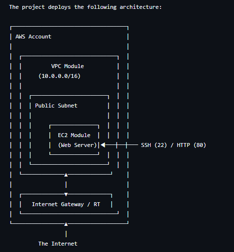

# aws-secure-infrastructure-as-code
Organize code with modules (VPC module, EC2 module). A production-grade Terraform blueprint for deploying secure and modular AWS infrastructure using GitHub Actions and OIDC for keyless authentication.

# Terraform AWS Modular Infrastructure Blueprint

This repository contains a production-grade, modular Terraform project for deploying a secure network foundation (VPC) and a web server (EC2) on AWS.

It is designed as a secure starting point for building a robust Infrastructure-as-Code (IaC) practice, demonstrating best practices for module composition, environment management, and secure CI/CD automation.

## Architecture



## Features

- **Modular Design**: Infrastructure is logically separated into `vpc` and `ec2` modules for reusability and clarity.
- **Environment Management**: Use `.tfvars` files (`dev.tfvars`, `prod.tfvars`) to manage distinct environments.
- **Remote State Management**: Configured with an S3 backend for secure, collaborative state management.
- **Secure CI/CD Automation**: Includes GitHub Actions workflows for validating changes (`plan`) and deploying them (`apply`) using a secure, keyless authentication method (OIDC).

## 🚨 Security Considerations: OIDC Authentication

This project is configured to use **OpenID Connect (OIDC)** for authenticating GitHub Actions with AWS. This is the industry best practice and is significantly more secure than storing long-lived IAM access keys as GitHub secrets.

**You must deploy the IAM resources in `iam.tf` first** to establish this trust relationship. Do not use static `AWS_ACCESS_KEY_ID` secrets in your repository.

## Prerequisites

1.  **Terraform CLI**: Version 1.2.0 or newer.
2.  **AWS Account & Credentials**: For your initial local setup, configure your AWS credentials (`~/.aws/credentials`).
3.  **S3 Backend Resources**: You must manually create an S3 bucket and a DynamoDB table in AWS *before* initializing Terraform. Update `backend.tf` with your resource names.

## Usage

1.  **Clone the repository:**
    ```sh
    git clone <your-repo-url>
    cd terraform-project
    ```

2.  **Configure and Deploy OIDC Role (One-time setup):**
    -   Update the `iam.tf` file, replacing `YourGitHubUsername/YourRepoName` with your repository details.
    -   Run `terraform init` and `terraform apply` locally to create the secure IAM role for GitHub Actions.
    -   Update the workflow files in `.github/workflows/` with the ARN of the created role.

3.  **Deploy an Environment:**
    -   Copy the example variables file: `cp terraform.tfvars.example dev.tfvars`.
    -   Edit `dev.tfvars` with your desired settings.
    -   Initialize: `terraform init`
    -   Plan: `terraform plan -var-file="dev.tfvars"`
    -   Apply: `terraform apply -var-file="dev.tfvars"`

## CI/CD and Branching Strategy

This repository uses a GitFlow-style branching strategy to manage environments:

-   `develop` **Branch:** Represents the **development** environment. All feature branches are merged here. Pull requests to `develop` trigger a `terraform plan` against `dev.tfvars`.
-   `main` **Branch:** Represents the **production** environment. Changes are only merged from `develop`. Pushes to `main` trigger the deployment workflow, which requires manual approval before running `terraform apply` with `prod.tfvars`.
